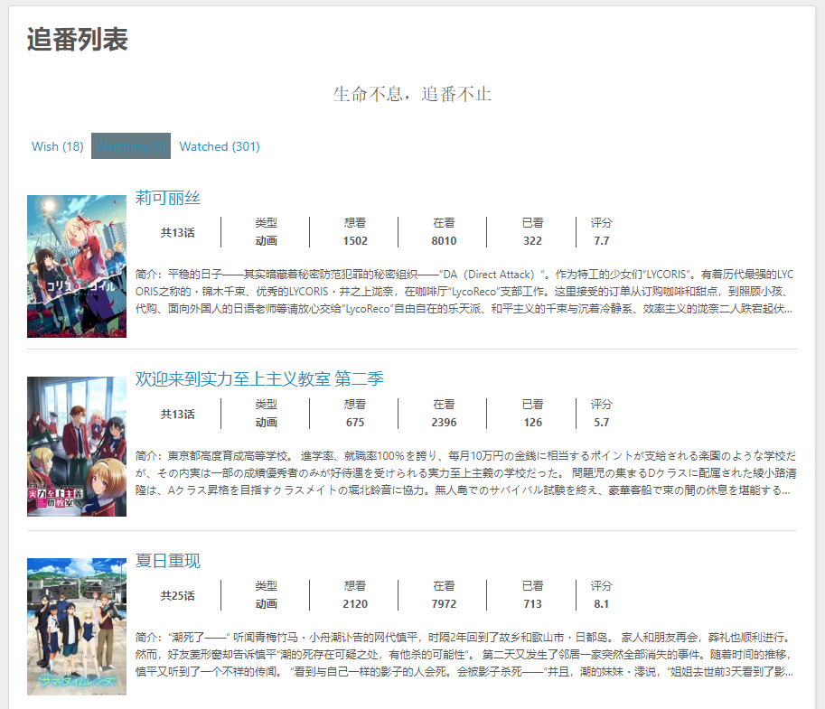

# hexo-bangumis

[](https://www.npmjs.com/package/hexo-bangumis)

## 介绍

**为 Hexo 添加 [Bangumi](https://bangumi.tv/) 追番页面，参考自 [HCLonely/hexo-bilibili-bangumi](https://github.com/HCLonely/hexo-bilibili-bangumi)**.

## 特色功能

* 使用 [bgm.tv](https://bgm.tv) 的官方 [API](https://github.com/bangumi/api) 来进行爬取，番剧更多，可用性更高
* 支持数据缓存及番剧封面图本地化，防止因上游服务挂掉导致连锁效应，爬取好番剧后可纯离线场景下部署
* 极端条件下可通过编辑文件来自定义番剧列表，可自定义添加 [bgm.tv](https://bgm.tv) 没有的番剧
* 总的来说，只要你爬取过这个番剧，那么就算将来 [bgm.tv](https://bgm.tv) 上把这个番剧删掉了，你也可以继续使用这个番剧

## 预览



## 安装

在 Hexo 文件夹下执行:
```bash
$ npm install hexo-bangumis --save
```

## 配置

将下面的配置写入 **站点** 的配置文件 `_config.yml` 中:

``` yaml
bangumis:
  enable: true              # 是否启用
  path: bangumis/index.html # 生成追番页面的路径
  show: 1                   # 想看，在看，看完
  title: '追番列表'          # 标题
  quote: '生命不息，追番不止' # 格言
  color_meta: "#555"        # 追番项元数据的颜色
  color_summary: "#555"     # 追番项简介的颜色
  bgmtv_uid: mmdjiji        # bgm.tv的uid
  download_image: true      # 下载图片并使用本地图片，否则使用bgm.tv提供的网络图源
  lazyload: true            # 是否开启懒加载
```

## 使用

更新追番数据:
```bash
$ hexo bangumis -u
```

删除追番数据:
```
$ hexo bangumis -d
```

## 获取 [bgm.tv](https://bgm.tv) 的 uid

登录 [bgm.tv](https://bgm.tv) 后打开控制台（快捷键 `Ctrl` + `Shift` + `J`），输入 `CHOBITS_UID` 后按回车，得到的数字就是 `uid` 啦~

## Lisense

[Apache Licence 2.0](LICENSE)
